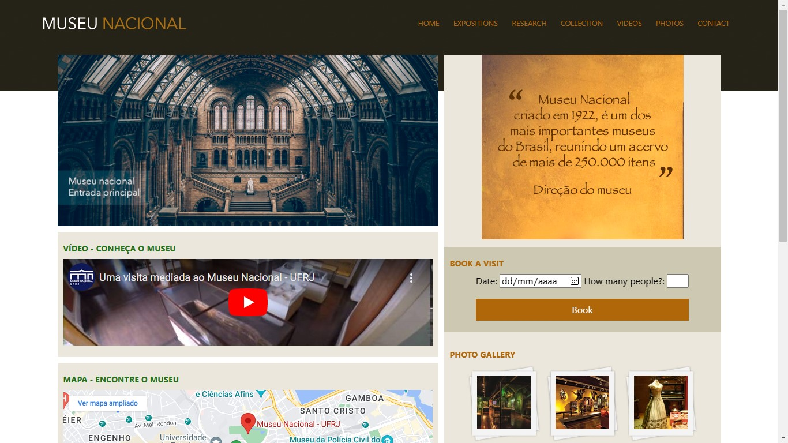

# National Museum Site

## A study about web design using "Flexbox" to build a responsive website

Hi! This is another project i've done for a Udemy course that i'm studying about Full Stack Web Development. I already have a project here in GitHub showing how i used float and position to create a site with fixed/liquid layouts ([_See it here_](https://gudaoliveira.github.io/Chale-Hotel-Site)), and this is the evolution of that

Finally i'm learning how to create responsive layouts despite knowing that "Flexbox" isn't the only solution nowadays, and the best pratice is to use it together with "CSS Grid", but i'll leave that for the next project.

To see the site [_Click Here_](https://gudaoliveira.github.io/Nacional-Museum-Site/) or in the description of this repo

## Screenshot

## Known issues

Yes, i know that the _"Cards"_ on the _"Main Section"_ are not working in the best way possible, but i could not figure out a better way to do it without the "CSS Grid" and i didn't want to spend more time trying to figure out by my own

## Want to contribute?

This is a good piece of portifolio to me, but it could be a great piece of portifolio for us! So feel free to contribute in any way that you might think i would enhance the site

* Provide better SEO to the site
* Create other pages
* Fix the size of the _"Cards"_ on the _"Main Section"_ so that it stays more visible 
* Or simply rewrite something you could make it better

Made with 💞 in :brazil: